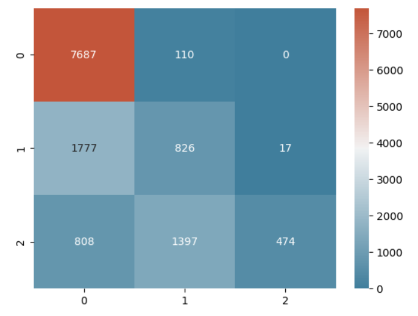

# Jet Engine Health Monitoring System

  

[My Original Kaggle Notebook](https://www.kaggle.com/code/szxivk/turbofan-engine-condition-prediction)

## Overview
In aerospace maintenance, predicting the exact "time to failure" is often less valuable than knowing the **current health state** of an engine. This project builds a predictive maintenance system that classifies NASA turbofan engines into three actionable risk categories based on sensor data.

Instead of raw RUL regression, this system calculates a **Life Ratio (LR)** to normalize engine wear across different units and predicts the safety status.

## Operational Status Classifications
The model categorizes engine health into the following system for maintenance decision-making:

| Label | Status | Criteria (Life Ratio) | Operational Action |
| :--- | :--- | :--- | :--- |
| 🟢 **0** | **Good** | `LR <= 0.6` | Safe to fly. No action needed. |
| 🟡 **1** | **Moderate** | `0.6 < LR <= 0.8` | Flag for upcoming maintenance. |
| 🔴 **2** | **Warning** | `LR > 0.8` | **CRITICAL:** Immediate Grounding/Overhaul. |

## Methodology & Engineering
* **Data Cleaning:** Removed 11 low-variance features (e.g., `setting3`, `s01`, `s18`, `s19`) that offered no predictive signal.
* **Target Engineering:** Calculated `Life Ratio = Current_Cycle / Total_Cycles` to normalize wear.
* **Model:** **CatBoost Classifier** chosen for its robustness with categorical data and tabular performance.
* **Optimization:** Used `RandomizedSearchCV` to tune hyperparameters (`learning_rate=0.01`, `depth=10`, `l2_leaf_reg=0.01`).

## Key Results
* **Generalization:** Hyperparameter tuning increased Test Set accuracy from **67% to 69%** and nearly doubled the R2 score.
* **Safety First:** The model successfully minimizes "False Negatives" (predicting 'Good' when an engine is actually in 'Warning' state), which is the most critical metric for aviation safety.

 <br>
*(Figure 1: Confusion Matrix showing high recall for 'Warning' state to prevent false negatives)*


## Usage
1. **Clone the repo:**
   ```bash
   git clone [https://github.com/szxivk/jet-engine-health-monitoring.git](https://github.com/szxivk/jet-engine-health-monitoring.git)
   cd jet-engine-health-monitoring

2. **Install dependencies: (Note: This project strictly requires scikit-learn 1.5.2 to avoid compatibility issues with the latest version)**
    ```bash
    pip install -r requirements.txt

3. **Run the notebook:**
    ```bash
    jupyter notebook notebooks/turbofan_prediction.ipynb


## Data Source
NASA C-MAPSS (Commercial Modular Aero-Propulsion System Simulation).
[Download Data Here](https://www.kaggle.com/datasets/behrad3d/nasa-cmaps/data)

## Author's Note
This project applies concepts from the **[Machine Learning Specialization by DeepLearning.AI](https://coursera.org/share/636f9e0149f2bc61216cc0f9fa888f6b)** to a real-world aerospace scenario, focusing on the practical engineering implementation of predictive maintenance.

---
*Created by Shahroz Khan - Aerospace Engineering & Data Science*
